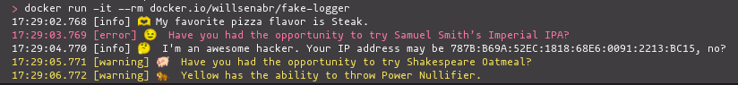

# FakeLogger

This repository provides an application that uses Elixir GenStages to print fake logs to stdout.

## Installation

To run locally, I recommend installing Elixir and Erlang as described here **.tool-versions** file.
ASDF is the simplest way to execute Elixir; you can read about ASDF with Elixir here:

- [Using ASDF to Manage Programming Language Runtime Versions](https://willsena.dev/using-asdf-to-manage-programming-language-runtime-versions/)


So run the following command to install Elixir requirements.

```shell
# install rebar and hex
mix local.hex --force &&  mix local.rebar --force

# get all deps
mix deps.get --all
```

## How to run?

After that, we can run the project with mix.


```shell
mix run --no-halt
```

You may test a Docker image from my DockerHub repository:

- [willsenabr/fake-logger] (https://hub.docker.com/repository/docker/willsenabr/fake-logger/general)

```bash
#docker
docker run -it --rm docker.io/willsenabr/fake-logger

# podman
podman run -it --rm docker.io/willsenabr/fake-logger
```




## Tests

Of course, there is test coverage, which you can run using the command:

```shell
mix test
```

## Release

Elixir enables us to produce releases from your project, which is awesome.

```shell
MIX_ENV=prod mix release

# starting release
_build/prod/rel/fake_logger/bin/fake_logger start
```